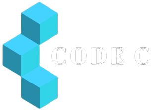
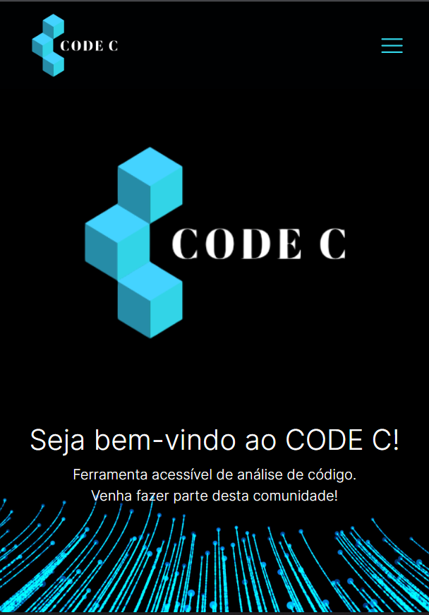
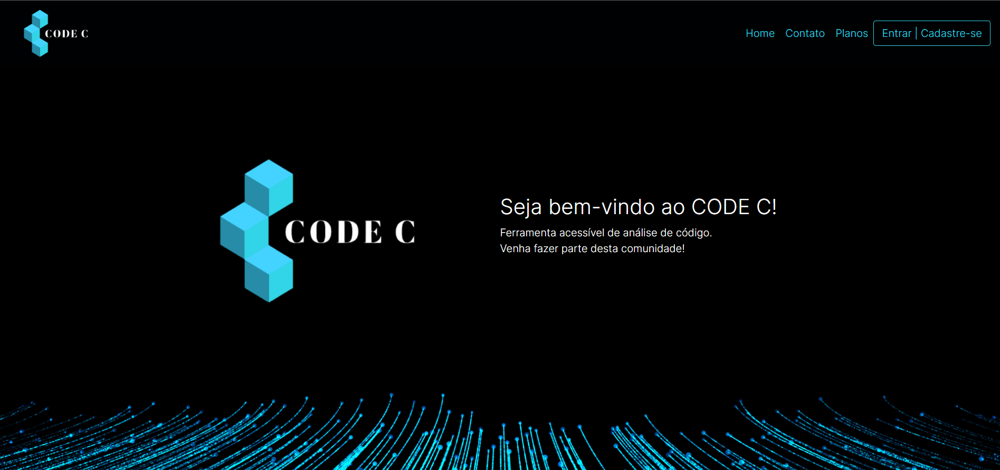

    

<h1 align="center">CodeC</h1>

    <a href="#-sobre-o-projeto">Sobre</a> •
    <a href="#-funcionalidades">Funcionalidades</a> •
    <a href="#-layout">Layout</a> • 
    <a href="#-como-executar-o-projeto">Como executar</a> • 
    <a href="#-tecnologias">Tecnologias</a> • 
    <a href="#-autores">Autores</a> • 
    <a href="#user-content--licença">Licença</a>

## 💻 Sobre o Projeto
💥 CodeC - blablablab blablabla lbalblablba lbblabal babalbalbal balbalblablabl blablablab albab alb alb ab alb al bla]
bambambma bma bmambmabmambma bmabab,ab,a,babkabkakbakbkabkab  bkbakb ab akb b ka bka b dashdushadsa.

Projeto com finalidade de aprimorar as habilidades voltadas para desenvolvimento front-end.

---

## ⚙️ Funcionalidades

### Site Institucional
    - [x] Os usuários tem acesso ao site por meio do computador ou celular, onde podem:
    - [x] acesso a todos os serviços oferecidos e seus respectivos preços.
    - [x] entrar em contato com a equipe através do E-mail.
    - [x] acesso a produtos disponiveis para compra.

---

## 🎨 Layout

O layout da aplicação está disponível no Canva:

### Mobile
<!-- PRINT dO SITE NO CELULAR -->

  

### Web
<!-- PRINT dO SITE NO COMPUTADOR -->

  

---

## 🛠 Tecnologias

As seguintes ferramentas foram usadas na construção do projeto:

#### **Website**

-   HTML 5
-   CSS 3
-   **[JavaScript](https://www.javascript.com/)**

#### **Utilitários**

-   Protótipo:  **[Canva](https://www.canva.com/)**  →  **[CodeC](https://www.figma.com/file/D41nbP0LDvkQfpi2z7JcjL/Hades-%7C-Barber-Lounge?node-id=1%3A2)**
-   API:  **[IBGE API](https://servicodados.ibge.gov.br/api/docs/localidades?versao=1)**  →  **[API de UFs](https://servicodados.ibge.gov.br/api/docs/localidades?versao=1#api-UFs-estadosGet)**,  **[API de Municípios](https://servicodados.ibge.gov.br/api/docs/localidades?versao=1#api-Municipios-estadosUFMunicipiosGet)**
-   Editor:  **[Visual Studio Code](https://code.visualstudio.com/)**
-   Fontes:  **[Forum](https://fonts.google.com/specimen/Forum?query=forum)**, **[Inter](https://fonts.google.com/specimen/Inter?query=inter)**

---

## 🦸 Autores

<table>
<tr>
<td>

 

 

</table>

<table>
<tr>
<td>

 

 

</td>
<td>
</td>
</tr>
</table>

---

## 📝 Licença

---